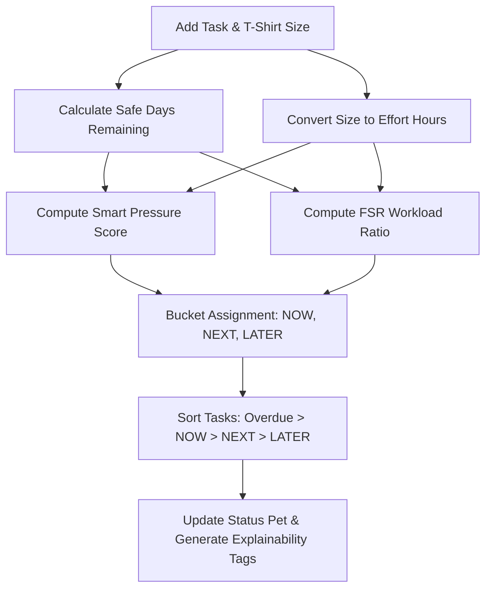

<div align="center">

# 🌸✨ PrioriTask 2000 ✨🌸
**Defeat Decision Fatigue. Master Your Deadlines.**

[-FF007F?style=for-the-badge&logo=googlechrome&logoColor=white)](https://github.com/razielsevilla/prioritask/releases/latest)
[](#)
[](#)

</div>

---

<div align="center">
  <i>"Instead of keeping a static to-do list, PrioriTask automatically ranks your school tasks into actionable Now, Next, and Later buckets using time pressure and workload capacity!"</i> 💿🦋
</div>

---

## 💖 Why I Built This

Students often face a massive wall of assignments due at different times, with varying effort and grade weights. This leads directly to choice paralysis and procrastination. 

**PrioriTask** is a local-first Manifest V3 Chrome extension designed to eliminate this decision fatigue. By analyzing remaining hours and estimated task sizes, it calculates your **Smart Time Pressure** and automatically organizes tasks into structured urgency buckets. Your perfect action pipeline is ready! 💅

---

## 🕹️ Core Features

*   **💾 Assignment Management & Nested Subtasks**: Add, edit, complete, and delete your tasks with ease. Supports breaking down parent tasks into smaller sub-tasks.
*   **⏱️ Smart Time Pressure Prioritization**: Automatically computes:
    $$\text{Pressure Score} = \frac{\text{Effort Hours}}{\text{Days Left}}$$
    Effort hours are simplified into intuitive **T-Shirt Sizes** ($S = 1\text{h}$, $M = 3\text{h}$, $L = 8\text{h}$).
*   **⚠️ FSR (Feasibility Status Report) Safety Net**: Calculates the ratio of required effort to available study hours:
    $$\text{FSR Ratio} = \frac{\text{Effort Hours}}{\text{Days Left} \times \text{Available Hours Per Day}}$$
    If your workload exceeds capacity ($\text{FSR} \ge 0.75$), the system raises risk tags and boosts the task's urgency.
*   **🗂️ Actionable Urgency Buckets**:
    *   **NOW**: Overdue tasks, tasks due within 48 hours, or tasks flagged with a High/Critical FSR Risk ($\text{FSR} \ge 0.75$).
    *   **NEXT**: Tasks due within 7 days, or tasks with high pressure scores ($> 1.0$).
    *   **LATER**: Low-priority backlog.
*   **✨ AI Subtask Breakdown (Gemini)**: Leverages Google's `gemini-2.5-flash` model to break down complex Medium/Large assignments into 3–5 actionable, calendar-spaced subtasks.
*   **🔄 Pinnacle LMS Scraper**: Integrated content script matching `https://pinnacle.pnc.edu.ph/*` that allows one-click importing of course assignments directly into your local database.
*   **😸 Interactive Status Pet**: A retro-style tamagotchi status pet inside the popup that changes behavior (optimal, focus mode, warning, or failure) based on the state of your pending and overdue workload.
*   **🚀 Immersive Kanban Dashboard**: A full-screen Kanban board view (`dashboard.html`) showing columns for `NOW`, `NEXT`, and `LATER` to track and manage assignments visually.
*   **🔔 MV3 Alarms & Background Notifications**: Periodically checks workloads in the background and sends native Chrome notifications for upcoming due dates, overdue assignments, and capacity warnings.

---

## ⚙️ How It Works (algo.exe)



---

## 💾 Installation (Dev Mode)

1. Download the latest `.zip` release from the [Releases page](https://github.com/razielsevilla/prioritask/releases/latest).
2. Extract the `.zip` file to a folder on your computer.
3. Open Chrome and navigate to `chrome://extensions/`.
4. Toggle **Developer mode** on in the top-right corner.
5. Click **Load unpacked** and select the folder you extracted (the one containing `manifest.json`).

---

## 🛠️ Developer Setup & Tech Stack

This project is structured as a monorepo consisting of the Chrome Extension and a landing page:

*   **Extension Tech Stack**: React, TypeScript, Vite, `@crxjs/vite-plugin`, Zod, Tailwind-free Vanilla CSS.
*   **Web Portal Tech Stack**: React, Vite, Custom Retro Y2K Styling.

### Development Commands

For either directory (`/extension` or `/web`), run:

```bash
# Install dependencies
npm install

# Run the local development server (Vite HMR)
npm run dev

# Run ESLint validation
npm run lint

# Run unit tests (Vitest)
npm run test -- --run

# Build production distribution bundles
npm run build
```

---

## 📂 Project Structure & Documents

*   [extension/](file:///c:/Users/Raziel/OneDrive/Documents/06_Projects/PrioriTask/extension) — Chrome Extension source code.
*   [web/](file:///c:/Users/Raziel/OneDrive/Documents/06_Projects/PrioriTask/web) — Marketing/landing web page code.
*   📜 [architecture.md](file:///c:/Users/Raziel/OneDrive/Documents/06_Projects/PrioriTask/docs/architecture.md) — System architecture, components, and data flow.
*   🗺️ [phases.md](file:///c:/Users/Raziel/OneDrive/Documents/06_Projects/PrioriTask/docs/phases.md) — Development roadmap, completion logs, and tracking.
*   🚀 [deployment.md](file:///c:/Users/Raziel/OneDrive/Documents/06_Projects/PrioriTask/docs/deployment.md) — Chrome Extension packaging and web publishing instructions.
*   🗄️ [schema.md](file:///c:/Users/Raziel/OneDrive/Documents/06_Projects/PrioriTask/docs/schema.md) — Storage structure and schema validation rules.
*   📁 [structure.md](file:///c:/Users/Raziel/OneDrive/Documents/06_Projects/PrioriTask/docs/structure.md) — Detailed layout mapping of directories and files.
*   🧮 [algorithms.md](file:///c:/Users/Raziel/OneDrive/Documents/06_Projects/PrioriTask/docs/algorithms.md) — Underlying prioritisation equations and formulas.

<div align="center">
  <br/>
  
  
  
  <br/>
  <p>★ &copy; 2026 PrioriTask. All rights reserved. ★</p>
</div>
